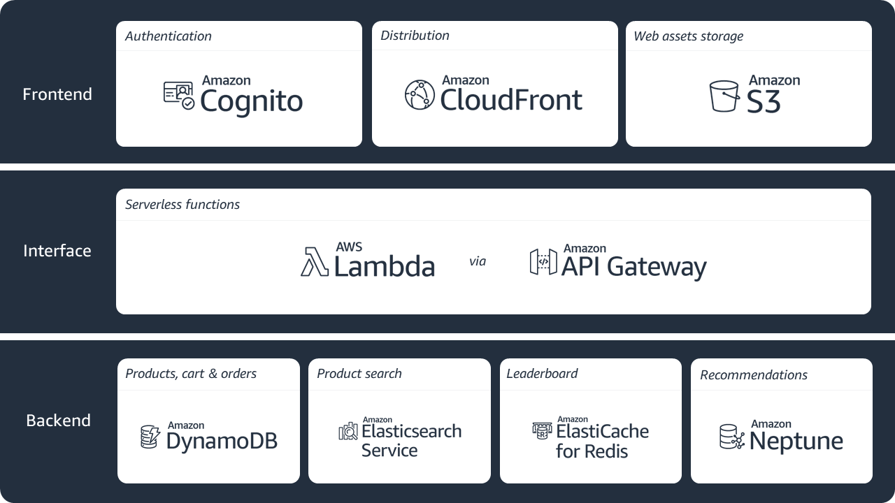
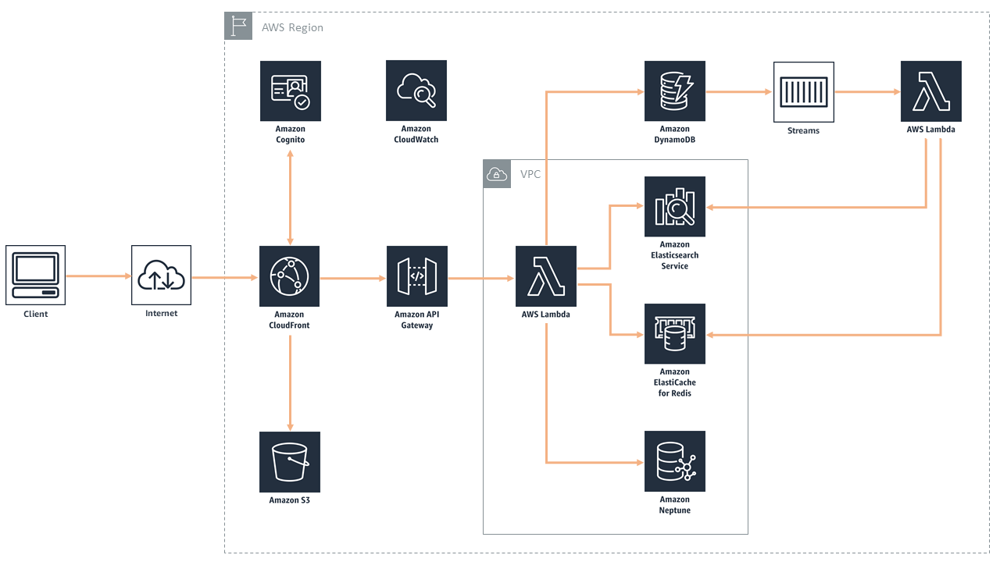

## AWS Bookstore Demo App

AWS Bookstore Demo App is a full-stack sample web application that creates a storefront (and backend) for customers to shop for fictitious books. The entire application can be created with a single CloudFormation template. [Try out the deployed application here](https://d2h3ljlsmzojxz.cloudfront.net/)!

You can browse and search for books, look at recommendations and best sellers, manage your cart, checkout, view your orders, and more.  Get started with building your own below!
&nbsp;

## License Summary

This sample code is made available under a modified MIT license. See the LICENSE file.

&nbsp;

## Outline

- [Overview](#overview)
- [Instructions](#instructions)
  - [Getting started](#getting-started)
  - [Cleaning up](#cleaning-up)
- [Architecture](#architecture)
- [Implementation details](#implementation-details)
  - [Amazon DynamoDB](#amazon-dynamodb)
  - [Amazon API Gateway](#amazon-api-gateway)
  - [AWS Lambda](#aws-lambda)
  - [Amazon ElastiCache for Redis](#amazon-elasticache-for-redis)
  - [Amazon Neptune](#amazon-neptune)
  - [Amazon ElasticSearch](#amazon-elasticsearch)
  - [AWS IAM](#aws-iam)
  - [Amazon Cognito](#amazon-cognito)
  - [Amazon Cloudfront and Amazon S3](#amazon-cloudfront-and-amazon-s3)
  - [Amazon VPC](#amazon-vpc)
  - [Amazon Cloudwatch](#amazon-cloudwatch)
  - [AWS CodeCommit, AWS CodePipeline, AWS CodeBuild](#aws-codecommit-aws-codepipeline-aws-codebuild)
- [Considerations for demo purposes](#considerations-for-demo-purposes)
- [Known limitations](#known-limitations)
- [Additions, forks, and contributions](#additions-forks-and-contributions)
- [Questions and contact](#questions-and-contact)

&nbsp;

## Overview

The goal of the AWS Bookstore Demo App is to provide a fully-functional web application that utilizes multiple purpose-built AWS databases and native AWS components like Amazon API Gateway and AWS CodePipeline. Increasingly, modern web apps are built using a multitude of different databases. Developers break their large applications into individual components and select the best database for each job. Let's consider the AWS Bookstore Demo App as an example. The app contains multiple experiences such a shopping cart, product search, recommendations, and a top sellers list. For each of these use cases, the app makes use of a purpose-built database so the developer never has to compromise on functionality, performance, or scale.

The provided CloudFormation template automates the entire creation and deployment of the AWS Bookstore Demo App.  The template includes the following components:

**Database components**

* Product catalog/shopping cart - Amazon DynamoDB offers fast, predictable performance for the key-value lookups needed in the product catalog, as well as the shopping cart and order history.  In this implementation, we have unique identifiers, titles, descriptions, quantities, locations, and price.
* Search - Amazon Elasticsearch Service enables full-text search for our storefront, enabling users to find products based on a variety of terms including author, title, and category.
* Recommendations - Amazon Neptune provides social recommendations based on what user's friends have purchased, scaling as the storefront grows with more products, pages, and users.
* Top sellers list - Amazon ElastiCache for Redis reads order information from Amazon DynamoDB Streams, creating a leaderboard of the “Top 20” purchased or rated books.

**Application components**

* Serverless service backend – Amazon API Gateway powers the interface layer between the frontend and backend, and invokes serverless compute with AWS Lambda.  
* Web application blueprint – We include a React web application pre-integrated out-of-the-box with tools such as React Bootstrap, Redux, React Router, internationalization, and more.

**Infrastructure components**

* Continuous deployment code pipeline – AWS CodePipeline and AWS CodeBuild help you build, test, and release your application code. 
* Serverless web application – Amazon CloudFront and Amazon S3 provide a globally-distributed application. 

You can choose to customize the template to create your own bookstore, modify it to make a different type of store, or change it to make a completely different type of web application.  

&nbsp;

---

&nbsp;

## Instructions

***IMPORTANT NOTE**: Creating this demo application in your AWS account will create and consume AWS resources, which **will cost money**.  We estimate that running this demo application will cost ~**$0.45/hour** with light usage.  Be sure to shut down/remove all resources once you are finished to avoid ongoing charges to your AWS account (see instructions on cleaning up/tear down below).*

&nbsp;

### Getting started

To get the AWS Bookstore Demo App up and running in your own AWS account, follow these steps (if you do not have an AWS account, please see [How do I create and activate a new Amazon Web Services account?](https://aws.amazon.com/premiumsupport/knowledge-center/create-and-activate-aws-account/)):

1. Log into the [AWS console](https://console.aws.amazon.com/) if you are not already
2. Choose **Launch Stack**  to open the AWS CloudFormation console and create a new stack.  
[](https://console.aws.amazon.com/cloudformation/home?region=us-east-1#/stacks/new?stackName=MyBookstore&templateURL=https://s3.amazonaws.com/aws-bookstore-demo/master-fullstack.template)
3. Continue through the CloudFormation wizard steps
    1. Name your stack, i.e. MyBookstore
    2. Name your S3 bucket (must be lowercase and has to unique across all existing bucket names in Amazon S3).  See [bucket naming rules](https://docs.aws.amazon.com/AmazonS3/latest/dev//BucketRestrictions.html#bucketnamingrules).
    3. Provide a project name (must be lowercase, letters only, and **under ten characters**).  This is used when naming your resources, i.e. tables, search domain, etc.).
    4. After reviewing, check the blue box for creating IAM resources.
4. Choose **Create stack**.  This will take ~20 minutes to complete.
5. Sign into your application 
    1. The output of the CloudFormation stack creation will provide a CloudFront URL (in the *Outputs* section of your stack details page).  Copy and paste the CloudFront URL into your browser.
    2. You can sign into your application by registering an email address and a password.  Choose **Sign up to explore the demo** to register.  The registration/login experience is run in your AWS account, and the supplied credentials are stored in Amazon Cognito.  *Note: given that this is a demo application, we highly suggest that you do not use an email and password combination that you use for other purposes (such as an AWS account, email, or e-commerce site).*
    3. Once you provide your credentials, you will receive a verification code at the email address you provided. Upon entering this verification code, you will be signed into the application.

&nbsp;

*Advanced: The source CloudFormation template is available [here](https://s3.amazonaws.com/aws-bookstore-demo/master-fullstack.template). If you want to maintain low latency for your app, [this deeplink](https://console.aws.amazon.com/cloudformation/home?region=us-east-1#/stacks/new?stackName=MyBookstore&templateURL=https://s3.amazonaws.com/aws-bookstore-demo/master-fullstack-with-lambda-triggers.template) will create an identical stack, but with additional triggers to keep the Lamdba functions "warm" (CloudFormation template [here](https://s3.amazonaws.com/aws-bookstore-demo/master-fullstack-with-lambda-triggers.template)).  For more information, see the [Considerations for demo purposes](#considerations-for-demo-purposes) section.*

&nbsp;

### Cleaning up

To tear down your application and remove all resources associated with the AWS Bookstore Demo App, follow these steps:

1. Log into the AWS CloudFormation Console and find the stack you created for the demo app
2. Delete the stack
    1. Double-check that the S3 buckets created for the stack were successfully removed.

Remember to shut down/remove all related resources once you are finished to avoid ongoing charges to your AWS account.

&nbsp;

---

&nbsp;

## Architecture

**Summary diagram**



&nbsp;

**High-level, end-to-end diagram**



&nbsp;

**Frontend**

Build artifacts are stored in a S3 bucket where web application assets are maintained (like book cover photos, web graphics, etc.). Amazon CloudFront caches the frontend content from S3, presenting the application to the user via a CloudFront distribution.  The frontend interacts with Amazon Cognito and Amazon API Gateway only.  Amazon Cognito is used for all authentication requests, whereas API Gateway (and Lambda) is used for all API calls interacting across DynamoDB, ElasticSearch, ElastiCache, and Neptune. 

**Backend**

The core of the backend infrastructure consists of Amazon Cognito, Amazon DynamoDB, AWS Lambda, and Amazon API Gateway. The application leverages Amazon Cognito for user authentication, and Amazon DynamoDB to store all of the data for books, orders, and the checkout cart. As books and orders are added, Amazon DynamoDB Streams push updates to AWS Lambda functions that update the Amazon Elasticsearch cluster and Amazon ElasticCache for Redis cluster.  Amazon Elasticsearch powers search functionality for books, and Amazon Neptune stores information on a user's social graph and book purchases to power recommendations. Amazon ElasticCache for Redis powers the books leaderboard. 


&nbsp;

**Developer Tools**

The code is hosted in AWS CodeCommit. AWS CodePipeline builds the web application using AWS CodeBuild. After successfully building, CodeBuild copies the build artifacts into a S3 bucket where the web application assets are maintained (like book cover photos, web graphics, etc.). Along with uploading to Amazon S3, CodeBuild invalidates the cache so users always see the latest experience when accessing the storefront through the Amazon CloudFront distribution.  AWS CodeCommit. AWS CodePipeline, and AWS CodeBuild are used in the deployment and update processes only, not while the application is in a steady-state of use.


&nbsp;

---

&nbsp;

## Implementation details

*Note: The provided CloudFormation template contains only a portion of the resources needed to create and run the application.  There are web assets (images, etc.), Lambda functions, and other resources called from the template to create the full experience.  These resources are stored in a public-facing S3 bucket and referenced in the template.*

&nbsp;

### Amazon DynamoDB

The backend of the AWS Bookstore Demo App leverages Amazon DynamoDB to enable dynamic scaling and the ability to add features as we rapidly improve our e-commerce application. The application create three tables in DynamoDB: Books, Orders, and Cart.  DynamoDB's primary key consists of a partition (hash) key and an optional sort (range) key. The primary key (partition and sort key together) must be unique.

**Books Table:**

```js
BooksTable {
  id: string (primary partition key)
  author: string
  category: string (index, GSI)
  cover: string (url to s3 file)
  name: string 
  price: number
  rating: number
}
```

The table's partition key is the ID attribute of a book. The partition key allows you to look up a book with just the ID. Additionally, there is a global secondary index (GSI) on the category attribute. The GSI allows you to run a query on the category attribute and build the books by category experience. 

For future updates to the application, we plan to return the results of a search/filter by category via ElasticSearch.  Additionally, there is no “description” attribute, as this sample application does not feature pages for individual books.  This may be something users wish to add.

&nbsp;

**Orders Table:**

```js
OrdersTable {
    customerId: string (primary partition key)
    orderId: string (uuid, primary sort key)
    books: bookDetail[]
    orderDate: date 
}
```

```js
bookDetail {
    bookId: string
    customerId: string
    quantity: number
    price: number
}
```

The order table's partition key is the customer ID. This allows us to look up all orders of the customer with just their ID. 

&nbsp;

**Cart Table:**

```js
CartTable {
    customerId: string (primary partition key)
    bookId: string (uuid, primary sort key)
    price: number
    quantity: number
}
```

The cart table stores information about a customer's saved cart.

&nbsp;

### Amazon API Gateway

Amazon API Gateway acts as the interface layer between the frontend (Amazon CloudFront, Amazon S3) and AWS Lambda, which calls the backend (databases, etc.). Below are the different APIs the application uses:

**Books (DynamoDB)**

GET /books (ListBooks)  
GET /books/{:id} (GetBook)

**Cart (DynamoDB)**

GET /cart (ListItemsInCart)  
POST /cart (AddToCart)  
PUT /cart (UpdateCart)  
DELETE /cart (RemoveFromCart)  
GET /cart/{:bookId} (GetCartItem)

**Orders (DynamoDB)**

GET /orders (ListOrders)  
POST /orders (Checkout)  

**Best Sellers (ElastiCache)**

GET /bestsellers (GetBestSellers)

**Recommendations (Neptune)**

GET /recommendations (GetRecommendations)  
GET /recommendations/{bookId} (GetRecommendationsByBook)

**Search (ElasticSearch)**

GET /search (SearchES)

&nbsp;

### AWS Lambda

AWS Lambda is used in a few different places to run the application, as shown in the architecture diagram.  The important Lambda functions that are deployed as part of the template are shown below, and available in the [functions](/functions) folder.  In the cases where the response fields are blank, the application will return a statusCode 200 or 500 for success or failure, respectively.

&nbsp;

**ListBooks**
Lambda function that lists the books in the specified product category

```js
ListBooksRequest {
    category?: string (optional parameter)  
}
```

```js
ListBooksResponse {
    books: book[]
}
```

```js
book {
    id: string
    category: string
    name: string 
    author: string
    description: string
    rating: number
    price: number
    cover: string
}
```

&nbsp;

**GetBook**
Lambda function that will return the properties of a book.

```js
GetBookRequest {
  bookId: string
}
```

```js
GetBookResponse {
    id: string
    category: string
    name: string 
    author: string
    description: string
    rating: number
    price: number
    cover: string
}
```

&nbsp;

**ListItemsInCart**
Lambda function that lists the orders a user has placed.

```js
ListItemsInCartRequest {

}
```

```js
ListItemsInCartResponse {
    orders[]
}
```

```js
order {
    customerId: string
    bookId: string
    quantity: number
    price: number
}
```

&nbsp;

**AddToCart**
Lambda function that adds a specified book to the user's cart.  Price is included in this function's request so that the price is passed into the cart table in DynamoDB.  This could reflect that the price in the cart may be different than the price in the catalog (i.e. books table) perhaps due to discounts or coupons.

```js
AddToCartRequest {
    bookId: string
    quantity: number
    price: number
}
```

```js
AddToCartResponse {

}
```

&nbsp;

**RemoveFromCart**
Lambda function that removes a given book from the user's cart.  

```js
RemoveFromCartRequest {
    bookId: string
}
```

```js
RemoveFromCartResponse {

}
```

&nbsp;

**GetCartItem**
Lambda function that returns the details of a given item the user's cart.

```js
GetCartItemRequest {
    bookId: string
}
```

```js
GetCartItemResponse {
    customerId: string
    bookId: string
    quantity: number
    price: number
}
```

&nbsp;

**UpdateCart**
Lambda function that updates the user's cart with a new quantity of a given book.

```js
UpdateCartRequest {
    bookId: string
    quantity: number
}
```

```js
UpdateCartResponse {
    
}
```

&nbsp;

**ListOrders**
Lambda function that lists the orders for a user.

```js
ListOrdersRequest {

}
```

```js
ListOrdersResponse {
    customerId: string 
    orderId: string
    orderDate: date
    books: bookDetail[]
}
```

```js
bookDetail {
    bookId: string
    price: number
    quantity: number
}
```

&nbsp;

**Checkout**
Lambda function that moves the contents of a user's cart (the books) into the checkout flow, where you can then integrate with payment, etc.

```js
CheckoutRequest {
    books: bookDetail[]
}
```

```js
bookDetail {
    bookId: string
    price: number
    quantity: number
}
```

```js
CheckoutResponse {

}
```

In addition to the above, the *Checkout* Lambda function acts as a sort of mini-workflow with the following tasks:
1. Add all books from the Cart table to the Orders table
2. Remove all entries from the Cart table for the requested customer ID

&nbsp;

**GetBestSellers**
Lambda function that returns a list of the best-sellers.

```js
GetBestSellersRequest {

}
```

```js
GetBestSellersResponse {
    bookIds: string[]
}
```

&nbsp;

**GetRecommendations**
Lambda function that returns a list of recommended books based on the purchase history of a user's friends.

```js
GetRecommendationsRequest {

}
```

```js
GetRecommendationsResponse {
    recommendations: recommendation[]
}
```

```js
recommendation {
    bookId: string
    friendsPurchased: customerId[]
    purchases: number
}
```

```js
customerId: string
```

&nbsp;

**GetRecommendationsByBook**
Lambda function that returns a list of friends who have purchased this book as well as the total number of times it was purchased by those friends.

```js
GetRecommendationsByBookRequest {
    bookId: string
}
```

```js
GetRecommendationsByBookResponse {
    friendsPurchased: customerId[]
    purchased: number
}
```

```js
customerId: string
```

&nbsp;

**Other Lambda functions**
There are a few other Lambda functions used to make the AWS Bookstore Demo App work, and they are listed here:

1. Search - Lambda function that returns a list of books based on provided search parameters in the request.
2. updateSearchCluster - Lambda function that updates the ElasticSearch cluster when new books are added to the store.
3. updateBestsellers - Updates Leaderboard via the ElastiCache for Redis cluster as orders are placed.

&nbsp;

### Amazon ElastiCache for Redis

Amazon ElastiCache for Redis is used to provide the best sellers/leaderboard functionality.  In other words, the books that are the most ordered will be shown dynamically at the top of the best sellers list. 

For the purposes of creating the leaderboard, the AWS Bookstore Demo App utilized [ZINCRBY](https://redis.io/commands/zincrby), which *“Increments the score of member in the sorted set stored at key byincrement. If member does not exist in the sorted set, it is added with increment as its score (as if its previous score was 0.0). If key does not exist, a new sorted set with the specified member as its sole member is created.”*

The information to populate the leaderboard is provided from DynamoDB via DynamoDB Streams.  Whenever an order is placed (and subsequently created in the **Orders** table), this is streamed to Lambda, which updates the cache in ElastiCache for Redis.  The Lambda function used to pass this information is **UpdateBestSellers**. 

&nbsp;

### Amazon Neptune

Neptune provides a social graph that consists of users, books.  Recommendations are only provided for books that have been purchased (i.e. in the list of orders). The “top 5” book recommendations are shown on the bookstore homepage. 

&nbsp;

### Amazon ElasticSearch

Amazon Elasticsearch Service powers the search capability in the bookstore web application, available towards the top of every screen in a search bar.  Users can search by title, author, and category. The template creates a search domain in the Elasticsearch service.

It is important that a service-linked role is created first (included in the CloudFormation template).

&nbsp;

### AWS IAM

**ListBooksLambda**
AWSLambdaBasicExecutionRole  
dynamodb:Scan - table/Books/index/category-index  
dynamodb:Query - table/Books

**GetBookLambda**
AWSLambdaBasicExecutionRole  
dynamodb:GetItem - table/Books

**ListItemsInCartLambda**
AWSLambdaBasicExecutionRole  
dynamodb:Query - table/Cart

**AddToCartLambda**
AWSLambdaBasicExecutionRole  
dynamodb:PutItem - table/Cart

**UpdateCartLambda**
AWSLambdaBasicExecutionRole  
dynamodb:UpdateItem - table/Cart

**ListOrdersLambda**
AWSLambdaBasicExecutionRole  
dynamodb:Query - table/Orders

**CheckoutLambda**
AWSLambdaBasicExecutionRole  
dynamodb:PutItem - table/Orders  
dynamoDB:DeleteItem - table/Cart

&nbsp;

### Amazon Cognito

Amazon Cognito handles user account creation and login for the bookstore application.  For the purposes of the demo, the bookstore is only available to browse after login, which could represent the architecture of different types of web apps.  Users can also choose to separate the architecture, where portions of the web app are publicly available and others are available upon login.

User Authentication
* Email address

Amazon Cognito passes the CognitoIdentityID (which AWS Bookstore Demo app uses as the Customer ID) for every user along with every request from Amazon API Gateway to Lambda, which helps the services authenticate against which user is doing what.

&nbsp;

### Amazon CloudFront and Amazon S3

Amazon CloudFront hosts the web application frontend that users interface with.  This includes web assets like pages and images.  For demo purposes, CloudFormation pulls these resources from S3.

&nbsp;

### Amazon VPC

Amazon VPC (Virtual Private Cloud) is used with Amazon Elasticsearch Service, Amazon ElastiCache for Redis, and Amazon Neptune.

&nbsp;

### Amazon CloudWatch

The capabilities provided by CloudWatch are not exposed to the end users of the web app, rather the developer/administrator can use CloudWatch logs, alarms, and graphs to track the usage and performance of their web application.

&nbsp;

### AWS CodeCommit, AWS CodePipeline, AWS CodeBuild

Similar to CloudWatch, the capabilities provided by CodeCommit, CodePipeline, and CodeBuild are not exposed to the end users of the web app.  The developer/administrator can use these tools to help stage and deploy the application as it is updated and improved.

&nbsp;

---

&nbsp;

## Considerations for demo purposes

1. In order to make the AWS Bookstore Demo App an effective demonstration from the moment it is created, the CloudFormation template kicks off a Lambda function we wrote to pre-load a list of books into the product catalog (the Books table in DynamoDB).  In the same way, we used a Lambda function to pre-load sample friends (into Neptune) and manually populated the list of Best Sellers (on the front page only).  This enables you to sign up as a new user and immediately see what the running store would look like, including recommendations based on what friends have purchased and what the best-selling books section does.  

2. You will notice that the Past orders and Best sellers pages are empty at first run.  These are updated as soon as an order is placed. 

3. For the purposes of this demo, we did not include a method to add or remove friends, and decided that every new user will be friends with everyone else (not the most realistic, but effective for this demo).  You are welcome to play around with changing this, adding friend control functionality, or manually editing friendships via the bookstore-friends-edges.csv file.

4. Web assets (pages, images, etc.) are pulled from a public S3 bucket via the CloudFormation template to create the frontend for the AWS Bookstore Demo App.  When building your own web application (or customizing this one), you will likely pull from your own S3 buckets.  If you customize the lambda functions, you will want to store these separately, as well.

5. Checkout is a simplified demo experience that customers can take and implement a real-world payment processing platform.  Similarly, the *View Receipt* button after purchase is non-functional, meant to demonstrate how you can add on to the app.

6. The CloudFormation template referenced in #2 of the [Getting started](#getting-started) section is everything you need to create the full-stack application.  However, when the application is newly created, or hasn't been used in some time, it may take a few extra seconds to run the Lamdba functions, which increases the latency of operations like search and listing books.  If you want to maintain low latency for your app, [this deeplink](https://console.aws.amazon.com/cloudformation/home?region=us-east-1#/stacks/new?stackName=MyBookstore&templateURL=https://s3.amazonaws.com/aws-bookstore-demo/master-fullstack-with-lambda-triggers.template) creates an identical stack but with additional triggers to keep the Lamdba functions "warm."  Given that these triggers make the Lamdba functions run more frequently (every 10 minutes, on a schedule), this will add a small amount to the overall cost to run the application.  The benefit is a more responsive application even when the Lamdba functions are not being regularly called by user activity.

&nbsp;

---

&nbsp;

## Known limitations

* The application was written for demonstration purposes and not for production use.
* Orders are backed by DynamoDB, but no mechanism exists to recreate the best sellers list in the unlikely scenario of a Redis failure.
* Upon the first use of a Lambda function, cold start times in a VPC can be slow. Once the Lambda function has been warmed up, performance will improve.  See #6 in [Considerations for demo purposes](#considerations-for-demo-purposes) for more information.
* The application is not currently designed for for high availability. You can increase the availability of the application by configuring the Amazon Elasticsearch, Amazon Neptune, and Amazon ElastiCache clusters with multiple instances across multiple AZs.
* The application enables multiple users to sign into the application but the social graph is single user. As a result, different users will see the same social graph. Further, when new books are purchased, that state is not reflected in the social graph.
* There are some network errors observed on Firefox.  We are looking into this.

&nbsp;

---

&nbsp;

## Additions, forks, and contributions

We are excited that you are interested in using the AWS Bookstore Demo App!  This is a great place to start if you are just beginning with AWS and want to get a functional application up and running.  It is equally useful if you are looking for a sample full-stack application to fork off of and build your own custom application.  We encourage developer participation via contributions and suggested additions.  Of course you are welcome to create your own version!

Please see the [contributing guidelines](CONTRIBUTING.md) for more information.

&nbsp;

---

&nbsp;

## Questions and contact

For questions on the AWS Bookstore Demo App, or to contact the team, please leave a comment on GitHub.
